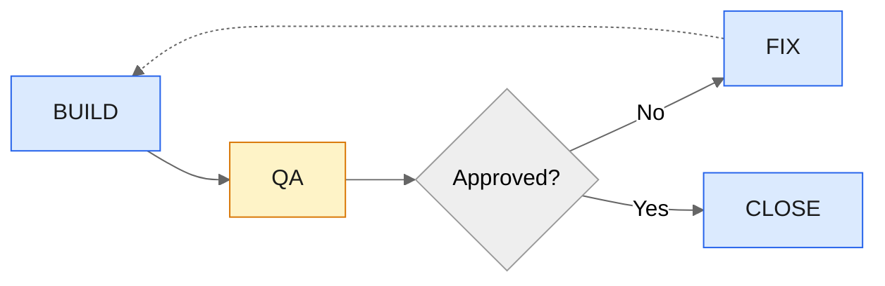

# Marty: ship code with agents that don't trust each other


*An adversarial build/review loop for multi-agent workspaces.*

One agent builds. A different agent reviews. They go back and forth until the code is actually right.

Why? Because AI agents are confident idiots. Fast, but sloppy when left unsupervised. A builder agent will write plausible code that passes at a glance and silently introduce regressions it can't see. A separate reviewer agent, with fresh context and a different model's blind spots, catches what the builder missed.

You spread API credit usage across providers instead of burning through one, and you get a natural audit trail from the handoff file. The workflow is simple, the feedback loop is tight, and the code that lands is better than either agent would produce alone.

Once the project is set up and the scope is defined, a full session is one prompt:

```
Execute sprint 1
```

Marty handles the rest — build, review, fix, repeat, push.

## How It Works

```
You → Marty → Builder (builds + commits)
                  ↓ writes QA_HANDOFF.md
               QA Reviewer (reviews diff)
                  ↓ writes findings or approval
               ┌─ pending-fix → Builder again
               └─ approved → wrap up + push
```

The Marty coordinator spawns each agent as a subagent. A Stop hook reads `QA_HANDOFF.md` after each cycle and blocks the coordinator from exiting until the loop resolves.

## Why Not Single-Agent?

Single-agent loops are great for prototyping. Point a model at a problem, gate it with tests, let it rip. But it's grading its own homework, squashing context between iterations, and confidently passing to the next step whether it's actually ready or not. Technical debt migrates to the end of the project where the review phase balloons into a cleanup marathon.

Marty fixes two things:

**Adversarial review.** The builder and reviewer are different models from different providers with different blind spots. Gates catch what tests cover. The reviewer catches what tests *don't*: logic errors, security gaps, missing edge cases, architectural drift. Review happens every commit, not as a phase at the end.

**Structured handoff.** A single file (`QA_HANDOFF.md`) mediates the entire loop. Status transitions are explicit. The audit trail writes itself.

## The Loop



> 🔵 Builder &nbsp; 🟡 Reviewer

| Step | Agent | What Happens |
|------|-------|-------------|
| **BUILD** | Builder | Hydrate context, implement tasks, run gates, commit, write to QA_HANDOFF.md |
| **QA** | Reviewer | Review diff for bugs, regressions, security, test gaps. Write findings to QA_HANDOFF.md |
| **FIX** | Builder | Read findings, apply fixes, new commit. Back to QA |
| **CLOSE** | Builder | Mark scope done, reset QA_HANDOFF.md, push |

## Requirements

- **VS Code 1.111.0+** with GitHub Copilot Chat
- `chat.useCustomAgentHooks: true` in VS Code settings
- `chat.autopilot.enabled: true` in VS Code settings
- Two or more Copilot model providers (e.g., Claude + GPT)

## Quick Start

### 1. Copy files into your project

```bash
# From inside your project root:
cp -r path/to/marty/.github/agents/ .github/agents/
cp -r path/to/marty/scripts/hooks/ scripts/hooks/
cp path/to/marty/templates/QA_HANDOFF.md QA_HANDOFF.md
chmod +x scripts/hooks/*.sh
```

Or clone this repo into your project as a reference and copy what you need.

### 2. Customize the agents

Edit `.github/agents/builder.agent.md`:
- Set the `model` to your preferred builder model
- Update the system prompt to reference **your** project's instruction files, code patterns, and conventions

Edit `.github/agents/qa-reviewer.agent.md`:
- Set the `model` to your preferred reviewer model (should be a **different provider** than the builder for true adversarial review)
- Update the system prompt to reference **your** project's review rules

Edit `.github/agents/marty.agent.md`:
- Update workflow references if your scope/task files are named differently

### 3. Add to .gitignore

```gitignore
# Marty (local-only session state)
QA_HANDOFF.md
.marty-checkpoint.json
```

> **Note:** The agent files in `.github/agents/` and hook scripts *should* be committed — they're part of your project's workflow definition. Only the ephemeral state files are gitignored.

### 4. Enable VS Code settings

```json
{
  "chat.useCustomAgentHooks": true,
  "chat.autopilot.enabled": true
}
```

### 5. Restart VS Code and verify

Open Copilot Chat → agent dropdown → **Marty** should appear.

### 6. Run it

Select **Marty** → set permission to **Autopilot** → prompt:

```
Execute sprint 1 from subscope-1.md
```

## Customization

### Models

Edit the `model` field in each agent's frontmatter. Use the exact string from the Copilot model picker dropdown:

```yaml
# builder.agent.md
model: ['Claude Opus 4.6 (copilot)']

# qa-reviewer.agent.md
model: ['GPT-5.3-Codex (copilot)']
```

Fallback arrays are supported:

```yaml
model: ['GPT-5.3-Codex (copilot)', 'Claude Opus 4.6 (copilot)']
```

### Gates

Define your project's quality gates in the builder and reviewer prompts. Common examples:

```bash
npm run typecheck    # type checker
npm run build        # compiler
npm test             # test suite
cargo clippy && cargo test
go vet ./... && go test ./...
```

No commit should land without all gates green.

### Scope Files

Marty expects some way to define what the builder should work on. The default agents reference:
- A **scope file** (e.g., `SCOPE.md`) — what's done, active, and next
- A **subscope file** (e.g., `subscope-1.md`) — detailed task list for the current sprint

Adapt these references to whatever task management pattern your project uses.

### Context Hydration

For richer agent context, point your agents at project-specific instruction files in their system prompts. A typical setup:

```
Agent instruction file (CLAUDE.md, copilot-instructions.md, AGENTS.md)
        ↓
    PROMPT.md (architecture, vision)
        ↓
    SCOPE.md (progress tracking)
        ↓
    SUBSCOPE-*.md (current sprint tasks)
```

### Adding a Planner Agent

The default setup is two agents (builder + reviewer). To add a planning step:

1. Create `.github/agents/planner.agent.md` with a high-context model
2. Add `'Planner'` to the `agents` array in `marty.agent.md`
3. Update the coordinator's workflow to run the planner first

## Resume After Disconnect

If your session drops mid-loop, reopen Marty and say:

```
Resume
```

The `SessionStart` hook reads `.marty-checkpoint.json` + `QA_HANDOFF.md` and injects the full state — which sprint, which iteration, and what action to take next.

## QA_HANDOFF.md Format

The handoff file mediates the entire loop. Builder writes entries, reviewer appends verdicts.

**Builder writes:**
```markdown
- status: pending-qa
- commit: abc1234
- author: copilot

## Dev Notes
What changed and why. Key review points.
```

**Reviewer writes:**
```markdown
- status: pending-fix | approved
- author: codex

## Log
High / Medium / Low findings (severity-ordered)
Each: what's wrong, why it matters, file:line references
```

On close, the file resets to the idle template.

## Troubleshooting

| Symptom | Fix |
|---------|-----|
| Marty not in dropdown | Restart VS Code. Check `.github/agents/` contains the `.agent.md` files. |
| Hook not firing | Verify `chat.useCustomAgentHooks` is `true`. Check Output panel → "GitHub Copilot Chat Hooks". |
| Loop won't stop | Close the chat session. Or set `status: idle` in `QA_HANDOFF.md`. |
| Permission denied on hook | `chmod +x scripts/hooks/*.sh` |
| Wrong model used | Check the model picker for exact display names and update the `model` field. |

## File Reference

| File | Role |
|------|------|
| `.github/agents/marty.agent.md` | Coordinator — orchestrates the build→QA loop |
| `.github/agents/builder.agent.md` | Builder — implements tasks, runs gates, commits |
| `.github/agents/qa-reviewer.agent.md` | Reviewer — reviews diffs, writes findings or approval |
| `scripts/hooks/check-qa-status.sh` | Stop hook — blocks exit while loop is active |
| `scripts/hooks/resume-session.sh` | SessionStart hook — injects resume context after disconnect |
| `QA_HANDOFF.md` | Handoff file — mediates status between agents |
| `.marty-checkpoint.json` | Auto-generated checkpoint (ephemeral, gitignored) |

## License

MIT
